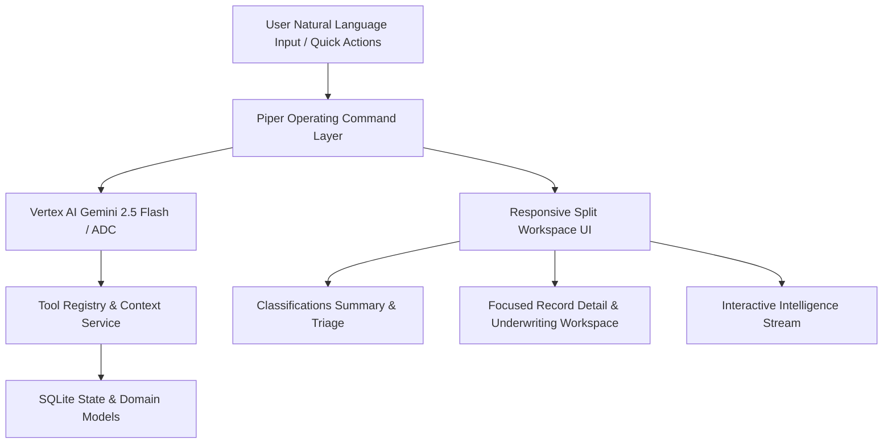

# OCG PIPELINE — Final UX + Piper Operating Experience Repair

This implementation plan resolves the layout imbalances, connects Piper to the live Vertex AI model provider (`google/gemini-2.5-flash`), upgrades the Classifications and Record workspaces, turns the Intelligence Stream into a clickable operational tool, and elevates Piper to visibly own and operate PIPELINE.

---

## User Review Required

> [!IMPORTANT]
> **Active Model Provider**: Google Vertex AI with `google/gemini-2.5-flash` using local Application Default Credentials (ADC) on project `ocg-pipeline`. This provides live natural language reasoning and tool execution while strictly respecting PIPELINE's database retrieval invariants and approval gates before writes.
>
> **Environment Loading**: `server.js` and `launch.ps1` will be updated to automatically load `.env`, ensuring that all start paths (`launch.bat`, `launch.ps1`, `npm start`, `node server.js`) boot with the live model provider enabled instead of falling back to `"none"`.

---

## Proposed Changes



---

### Backend & Model Provider Configuration

#### [MODIFY] [server.js](file:///C:/Users/Genaro/Claude/PIPELINE/server.js)
- Ensure `.env` is loaded automatically at startup if present (using `process.loadEnvFile()`).
- Log the active provider and model status on boot (`Vertex AI · google/gemini-2.5-flash`).

#### [MODIFY] [launch.ps1](file:///C:/Users/Genaro/Claude/PIPELINE/launch.ps1) & [local/Start-Pipeline.ps1](file:///C:/Users/Genaro/Claude/PIPELINE/local/Start-Pipeline.ps1)
- Ensure startup scripts pass `--env-file=.env` for explicit defense-in-depth across Windows launchers.

#### [MODIFY] [src/domain/piper/intentRouter.js](file:///C:/Users/Genaro/Claude/PIPELINE/src/domain/piper/intentRouter.js)
- Enhance intent routing and structured workspace directives (`openRecord`, `openView`, `filter`, `highlightRecord`, `openPanel`) so both deterministic and model-assisted responses can seamlessly command workspace navigation, record inspection, and underwriting transitions.

#### [MODIFY] [src/services/piper/piperRuntime.js](file:///C:/Users/Genaro/Claude/PIPELINE/src/services/piper/piperRuntime.js)
- Enrich model responses with workspace navigation directives when the user asks to inspect records, view provenance, transition to underwriting, or show unresolved classifications.

---

### Frontend Workspace & Visual System

#### [MODIFY] [public/styles.css](file:///C:/Users/Genaro/Claude/PIPELINE/public/styles.css)
- **Eliminate Dead Space & Layout Imbalance**:
  - Rework CSS Grid across 1440px, 1920px, and ultrawide viewports.
  - Ensure the main workspace and Piper dynamically consume available width with zero black dead zones.
- **Piper Operating Layer Redesign**:
  - Transform Piper from a narrow right-side chatbot into an integrated, resizable, and expandable operational workspace (Co-pilot mode, Expanded mode, Split Record view, Full Focus).
  - Add smooth transitions, glowing state pulses, and focused record highlights.
- **Classifications View & Record Detail Styling**:
  - Modern triage cards, evidence quality meters, provenance badges, and clean metric rows.
- **Interactive Intelligence Stream**:
  - Styled stream items with pulse dots, source badges, and clickable jump triggers.

#### [MODIFY] [public/index.html](file:///C:/Users/Genaro/Claude/PIPELINE/public/index.html)
- Modernize the structural layout to support flexible grid expansion, operational command bar, and workspace split views.
- Update telemetry and Piper header to cleanly show real connection status (`CONNECTED · Vertex AI / gemini-2.5-flash`).

#### [MODIFY] [public/app.js](file:///C:/Users/Genaro/Claude/PIPELINE/public/app.js)
- **Piper Workspace Control**:
  - Implement workspace directives: Piper can navigate routes (`/classifications`, `/opportunities/:id`), open specific tabs (Underwriting, Provenance, Evidence), highlight records with glowing focus animations, and split the workspace.
  - Implement conversational workflow: "Piper, what needs my attention?" -> summary + highlight highest-priority record -> "Show me why" -> open provenance beside Piper -> "Go to underwriting" -> transition workspace -> interrupt with "Actually, show me the unresolved classifications" -> instant abort and redirection.
- **Classifications Triage & Summary**:
  - Render an intelligent Piper operational summary header on the Classifications page.
  - Provide filter tabs (All, Needs Attention, Unresolved, Insufficient Evidence, Verified) and interactive action buttons.
- **Focused Record Detail**:
  - Render a clear, modular workspace: Record header, Provenance & Source trace, Evidence Quality score, Victor Underwriting panel (MAO, ARV, Rehab, Spread), Open Issues, and Piper Recommendations.
- **Interactive Intelligence Stream**:
  - Make every stream item clickable to immediately navigate to the target record and highlight it.
- **Interruptibility**:
  - Support instant request cancellation upon new input or manual stop button click, maintaining conversational context in thread history.

---

## Verification Plan

### Automated Tests
- Run full test suite:
  ```powershell
  npm test
  ```
- Test provider probe endpoint:
  ```powershell
  Invoke-RestMethod -Uri "http://127.0.0.1:8090/api/v1/piper/probe" -Method Post
  ```

### Acceptance Test Execution
Execute the required sequence against the live server:
1. Open PIPELINE (`http://127.0.0.1:8090`).
2. Verify Piper shows `CONNECTED` (`vertex-ai · google/gemini-2.5-flash`).
3. Send: `“Piper, what needs my attention?”` -> Verify state summary & highest-priority record highlight.
4. Send: `“Show me why.”` -> Verify provenance and evidence panel opens beside Piper.
5. Send: `“Go to underwriting.”` -> Verify workspace transitions directly to underwriting.
6. Mid-analysis send interrupt: `“Actually, show me the unresolved classifications.”` -> Verify immediate abort and redirection to unresolved classifications view without lost context.
7. Verify desktop layout composition at 1440px, 1920px, and mobile viewports with headless Chrome screenshots.
