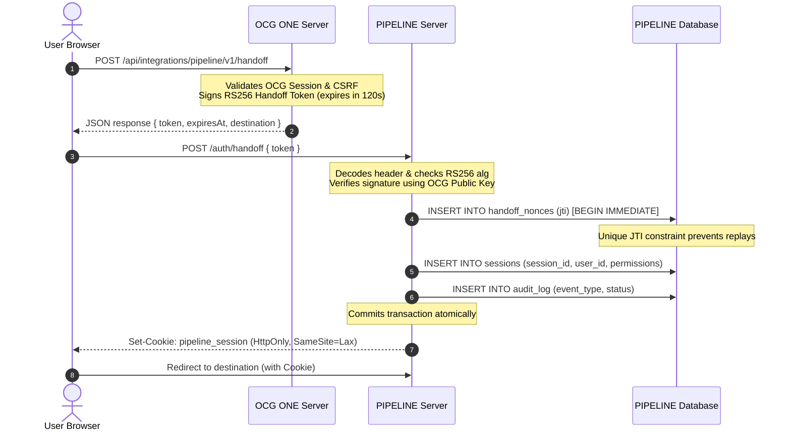

# PIPELINE Phase 3E — Authenticated OCG ONE Integration Contracts

This document contains the architecture, threat model, API specifications, and contract validations for the secure identity handoff and service-to-service communication between **OCG ONE** and **PIPELINE**.

---

## 1. Integration Architecture

The identity handoff is implemented using an asymmetric cryptographic architecture built on the JSON Web Signature (JWS) standard. PIPELINE and OCG ONE maintain separate asymmetric keypairs.

### User Identity Handoff Flow
The browser session handoff does not pass tokens in URLs or headers. Instead:
1. OCG ONE signs a user handoff token using its Private Key.
2. OCG ONE responds to a browser POST with the token in a payload.
3. The browser POSTs the token directly to PIPELINE's `/auth/handoff` endpoint.
4. PIPELINE verifies the signature using OCG ONE's Public Key, validates claims (including expiration, issuer, audience, and a one-time nonce), maps roles/permissions, and issues a secure `pipeline_session` cookie.

---

## 2. Threat Model & Mitigation Matrix

| Threat | Target / Vector | Risk | Mitigation in Phase 3E |
| :--- | :--- | :--- | :--- |
| **Spoofing (Token Forgery)** | User handoff | Critical | Signed RS256 JWS using strong 2048-bit RSA keys. Custom algorithms and HS256/none are strictly blocked at verification. |
| **Tampering (Privilege Escalation)** | Roles / Permissions | High | Role ceilings intersection: Final permissions = (Union of ceilings for recognized roles) $\cap$ (Incoming token permissions). Unknown roles or permissions are ignored. |
| **Replay Attacks** | Token reuse | Critical | Atomic unique constraint on `jti` in SQLite `handoff_nonces` table. Replaying a token fails immediate constraint checks and rolls back the transaction. |
| **Token Theft / Leakage** | Transport / Storage | Medium | Short-lived handoff tokens (TTL <= 120s), never stored in the database. Opaque random session tokens stored in HttpOnly, SameSite=Lax cookies. |
| **Cross-Site Request Forgery (CSRF)** | Session Logout | Medium | Double-submit / Synchronizer token mechanism stored alongside session. `POST /api/v1/auth/logout` rejects requests lacking the `X-CSRF-Token` header. |
| **Key Theft / Exposure** | Secrets Management | High | Environment config accepts Base64 keys only; secrets are validated at startup and masked from all error messages and console logs. |

---

## 3. API Contracts & Schema Validation

To prevent drift between OCG ONE and PIPELINE, both repositories implement contract validation tests that hash the schemas. If a schema changes in either repository, the tests immediately fail due to hash mismatch.

### Schema Hashes (SHA-256)
* **`ERROR_RESPONSE`**: `7cbfd4888e63d51d6c8fd105e61a950b96f819bb4301fd3204ab9c15429f02d4`
* **`HANDOFF_RESPONSE`**: `d8be25b6692f711a42f163cf597c86f8963db29ab7518b37c9215654cd40369f`
* **`LEAD_RESPONSE`**: `2d174b13d9f5db8b2b5e0094945194f074307447ddaf011ec642d91ed7662aad`
* **`PERMISSION_MAPPING`**: `a8de2172179c35e7009f31da33843817443be165e22d4130b0f3fb2f8935785f`
* **`PERSON_RESPONSE`**: `6e7035f4c2856fba7908cdd417b02eea7802fc73341d454725f2aeb62c497ff1`
* **`PROPERTY_RESPONSE`**: `5802d6dde21de06da1fc5792e30a72a6768574a932e3c5d6cf1ce0e8894da62b`
* **`ROLE_MAPPING`**: `3b23f0a40a5983b7b2a936557f9d372bb988b4b280120c685611007fe78ab0df`
* **`SERVICE_TOKEN_CLAIMS`**: `8ad8215c397a5f497d5bc54625bda8f36b2a070f6f6010770183f0186cd92375`
* **`USER_HANDOFF_CLAIMS`**: `812a0ccb6108c3baaa1e231cb1e35beaa71ab964493994c49f52fc4f7821f9a5`
